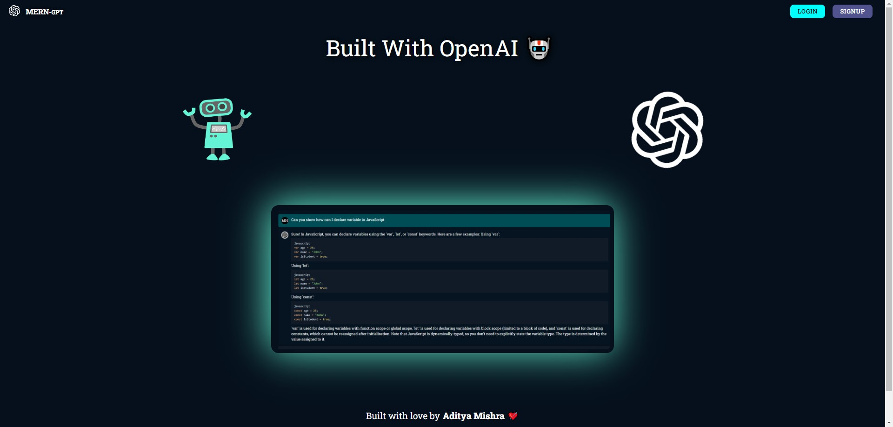

# AISync: Your Secure Chat Companion

**Unleash intelligent conversations, fortified by privacy.**

AISync is a personalized AI chatbot built on the MERN stack, designed to provide secure and engaging chat experiences. It seamlessly stores, retrieves, and deletes user messages, ensuring privacy through robust security measures.

**Key Features:**

- **Personalized AI Interaction:** Engage in meaningful conversations tailored to your unique preferences.
- **Secure Message Management:** Store, retrieve, and delete messages with confidence, protected by:
  - JWT Tokens
  - HTTP-Only Cookies
  - Encryption
- **MERN Stack Foundation:** Leveraging MongoDB, Express, React, and Node.js for a seamless user experience.

**Get Started:**

1. Clone the repository:
   ```bash
   git clone https://github.com/Ciriously/MERN-AI-ChatBot
   ```
2. Install dependencies:
   ```bash
   cd backend/frontend
   npm install
   ```
3. Start the development server:
   ```bash
   npm run dev
   ```

**Experience intelligent chat, safeguarded by AISync.**

**---**

**Output:**


